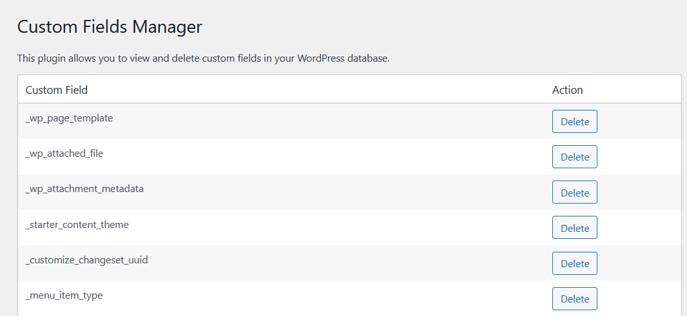

# Custom-Fields-Eraser for WordPress
**Warning: Deleting custom fields can potentially break your site. This plugin is intended for experienced administrators only.**

### Table of Contents

1. [Overview](#overview)
2. [Features](#features)
3. [Installation](#installation)
4. [Usage](#usage)
5. [Security Features](#security-features)
6. [Notes](#notes)
7. [Contributing](#contributing)
8. [License](#license)
9. [Support](#support)

## Overview

The Custom-Fields-Manager plugin adds a new "Custom Fields" menu item in the WordPress admin menu. It provides an interface to list and delete custom fields from the WordPress database, excluding some internal fields like `_edit_last` and `_edit_lock`.

**Important:** This plugin is designed for experienced administrators. The list of custom fields can be very long, and the initial load time might be significant depending on the number of custom fields.

## Features

- **Custom Fields Management:** View and delete custom fields from the WordPress database.
- **Permission Verification:** Ensures that only users with `manage_options` capability can access the plugin's functionalities.
- **Input Sanitization:** Utilizes `sanitize_text_field()` to sanitize the `$meta_key` before it is used in SQL queries or displayed.
- **WordPress Functions:** Employs WordPress functions like `$wpdb->get_results()` and `$wpdb->delete()` to handle database interactions securely.
- **AJAX Security:** Uses `check_ajax_referer()` to validate the security token (Nonce) for AJAX requests.

## Installation

1. Download the plugin and upload it to the `/wp-content/plugins/` directory.
2. Activate the plugin through the 'Plugins' menu in WordPress.

## Usage

1. After activation, navigate to the "Custom Fields" menu item in the WordPress admin menu.
2. The plugin will display a list of all custom fields in the database.
3. For each custom field, you will find a "Delete" button that allows you to remove the custom field from the database.

## Security Features

1. **Permission Verification:** 
    - Functions such as `custom_fields_manager_menu()`, `load_custom_fields_callback()`, and `delete_custom_field_callback()` check if the user has the required `manage_options` capability before execution.

2. **Sanitization of Inputs:**
    - The function `sanitize_text_field()` is used to clean the `$meta_key` before using it in SQL queries or displaying it.

3. **WordPress Functions:**
    - Instead of direct database access, WordPress functions like `$wpdb->get_results()` and `$wpdb->delete()` are used, which inherently apply security measures such as escaping and query preparation.

4. **AJAX Security Measures:**
    - AJAX functions use `check_ajax_referer()` to verify the validity of the security token (Nonce) before execution.

## Notes

- This plugin is intended for experienced WordPress administrators.
- The list of custom fields can be extensive, leading to longer load times on the first call.

## Contributing

1. Fork the repository.
2. Create a new branch (`git checkout -b feature-branch`).
3. Commit your changes (`git commit -am 'Add some feature'`).
4. Push to the branch (`git push origin feature-branch`).
5. Create a new Pull Request.

## License

This plugin is licensed under the [GPLv3 or later](https://www.gnu.org/licenses/gpl-3.0.html).

## Support
- **For support and feature requests, please open an issue on the [GitHub repository](https://github.com/VolkanSah/Custom-Fields-Eraser/issues).**
- If you appreciate my work, please consider [becoming a 'Sponsor'](https://github.com/sponsors/volkansah), giving a :star: to my projects, or following me. 
### Credits
- [VolkanSah on Github](https://github.com/volkansah)
- [Developer Site](https://volkansah.github.io)

